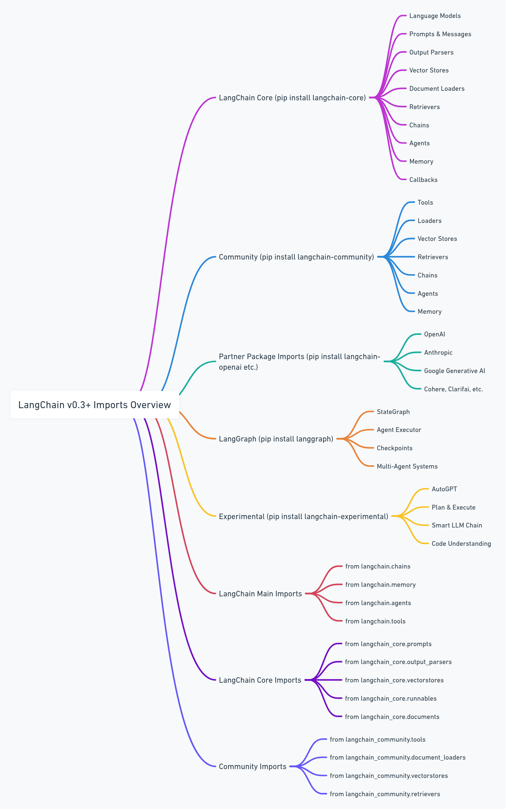

# Major LangChain imports

Created by: Mohd Faizy



# Major LangChain Imports

## 🏗️ Package Structure Changes

**IMPORTANT**: LangChain has been restructured into multiple packages. The old monolithic `langchain` package is now split into:

- `langchain-core`: Core abstractions and base classes
- `langchain-community`: Third-party integrations
- `langchain-openai`: OpenAI-specific integrations
- `langchain-anthropic`: Anthropic-specific integrations
- `langchain-google`: Google-specific integrations
- `langchain`: Main package (now lighter, orchestrates others)

### Installation

```bash
# Main package (optional, includes common chains and agents)
pip install langchain

# Core package (always needed)
pip install langchain-core

# Core LangChain ecosystem
pip install  langchain-community 

# Advanced agent orchestration
pip install langgraph

# Production monitoring
pip install langsmith

# Deployment
pip install langserve uvicorn fastapi

# Advanced retrieval
pip install faiss-cpu  # or faiss-gpu for large scale

# Provider-specific packages (install as needed)
pip install langchain-openai
pip install langchain-anthropic
pip install langchain-google
pip install langchain-community

```

---


---

## 🧠 LLMs (Language Models)

```python
# ❌ OLD WAY (deprecated)
from langchain.llms import OpenAI, Cohere, Anthropic, HuggingFaceHub

# ✅ NEW WAY (current)
from langchain_openai import OpenAI
from langchain_anthropic import AnthropicLLM
from langchain_google_genai import ChatGoogleGenerativeAI

# llms moved to community
from langchain_community.llms import Cohere, HuggingFaceHub, HuggingFacePipeline

```

### What these are

These classes provide **interfaces to LLMs**. LangChain wraps various third-party APIs or local pipelines, allowing you to treat them all in a standardized way.

Each LLM implements the `Runnable` interface with `.invoke()`, `.stream()`, `.batch()`, and `.ainvoke()` methods.

### Use Cases

- Basic completions (e.g., Q&A, summarization)
- Prompt engineering
- Backend of a chain or agent

### Differences

| Class | Backend | Package | Online? | Good For |
| --- | --- | --- | --- | --- |
| `OpenAI` | OpenAI API | `langchain-openai` | Yes | GPT-4, GPT-4o, GPT-3.5 |
| `AnthropicLLM` | Claude API | `langchain-anthropic` | Yes | Claude 2 models only |
| `Cohere` | Cohere API | `langchain-community` | Yes | Command models |
| `HuggingFaceHub` | HuggingFace cloud | `langchain-community` | Yes | Open source models |
| `HuggingFacePipeline` | Local HuggingFace | `langchain-community` | No | Offline inference |

---


---

## 🤖 Chat Models

```python
# ❌ OLD WAY (deprecated)
from langchain.chat_models import ChatOpenAI, ChatAnthropic, ChatGooglePalm

# ✅ NEW WAY (current)
from langchain_openai import ChatOpenAI
from langchain_anthropic import ChatAnthropic
from langchain_google import ChatGoogleGenerativeAI

from langchain_community.chat_models import ChatCohere

from langchain_huggingface import ChatHuggingFace, HuggingFaceEndpoint

```

### Purpose

These are used when interacting with **chat-style models** (multi-message inputs), like ChatGPT or Claude. They support **structured input** using message classes.

### How They Differ from LLMs

- LLMs take `str` as input.
- Chat models take a **list of `BaseMessage` objects**.

### Example

```python
from langchain_openai import ChatOpenAI
from langchain_core.messages import HumanMessage, SystemMessage

chat = ChatOpenAI(model="gpt-4")
result = chat.invoke([
    SystemMessage(content="You are a helpful assistant."),
    HumanMessage(content="Tell me a joke")
])

```

### Updated Chat Models

| Class | Backend | Package | Models Available |
| --- | --- | --- | --- |
| `ChatOpenAI` | OpenAI API | `langchain-openai` | GPT-4, GPT-4o, GPT-3.5-turbo |
| `ChatAnthropic` | Claude API | `langchain-anthropic` | Claude 3 Opus, Sonnet, Haiku |
| `ChatGoogleGenerativeAI` | Google AI | `langchain-google` | Gemini Pro, Gemini Pro Vision |
| `ChatCohere` | Cohere API | `langchain-community` | Command R, Command R+ |

---


---

## 🔘 Embedding models in LangChain

## OpenAI Embeddings

```python
from langchain_openai import OpenAIEmbeddings

# Usage
embeddings = OpenAIEmbeddings(
    model="text-embedding-3-small",  # or "text-embedding-3-large"
    dimensions=256    
)

```

## Hugging Face Embeddings

```python
from langchain_huggingface import HuggingFaceEmbeddings

# Usage
embeddings = HuggingFaceEmbeddings(
    model_name="sentence-transformers/all-MiniLM-L6-v2"
)

```

## Other Popular Embedding Models

```python
# Cohere
from langchain_cohere import CohereEmbeddings

# Anthropic (Claude)
from langchain_anthropic import AnthropicEmbeddings

# Google
from langchain_google_genai import GoogleGenerativeAIEmbeddings

# Ollama (local models)
from langchain_ollama import OllamaEmbeddings

# Azure OpenAI
from langchain_openai import AzureOpenAIEmbeddings

```

## FAISS Integration (common with embeddings)

```python
from langchain_community.vectorstores import FAISS
from langchain_openai import OpenAIEmbeddings

embeddings = OpenAIEmbeddings()
vector_store = FAISS.from_texts(texts, embeddings)

```

## Chroma Integration

```python
from langchain_chroma import Chroma
from langchain_openai import OpenAIEmbeddings

embeddings = OpenAIEmbeddings()
vector_store = Chroma.from_texts(texts, embeddings)
```

---


---

## 📦 Chains (Combine LLMs + Tools)

```python
# ❌ OLD WAY (some deprecated)
from langchain.chains import LLMChain, ConversationalRetrievalChain, RetrievalQA

# ✅ NEW WAY (current)
from langchain.chains import create_retrieval_chain, create_history_aware_retriever
from langchain_core.runnables import RunnablePassthrough, RunnableParallel
from langchain import hub  # For prompt templates

```

### What Chains Are

Modern LangChain emphasizes the **LCEL (LangChain Expression Language)** over traditional chains. You can compose operations using the `|` operator.

### Key Patterns

| Pattern | Purpose | Example |
| --- | --- | --- |
| **LCEL Chains** | Modern composition | `prompt | model | parser` |
| **Retrieval Chains** | RAG workflows | `create_retrieval_chain()` |
| **History-Aware** | Multi-turn RAG | `create_history_aware_retriever()` |
| **Runnable** | Base interface | All components implement this |

### Modern Example

```python
from langchain_core.output_parsers import StrOutputParser
from langchain_core.prompts import ChatPromptTemplate
from langchain_openai import ChatOpenAI

prompt = ChatPromptTemplate.from_template("Tell me about {topic}")
model = ChatOpenAI()
output_parser = StrOutputParser()

# LCEL chain composition
chain = prompt | model | output_parser
result = chain.invoke({"topic": "AI"})

```

---


---

## 📄 Prompts

```python
# ✅ CURRENT (mostly unchanged)
from langchain_core.prompts import (
    PromptTemplate,
    ChatPromptTemplate,
    SystemMessagePromptTemplate,
    HumanMessagePromptTemplate,
    MessagesPlaceholder
)

# Hub for sharing prompts
from langchain import hub

```

### Why Prompts Matter

LLMs are **prompt-driven**. Prompt classes let you define reusable templates with variables, making it easier to pass dynamic content.

### Prompt Classes

| Class | Purpose | Use Case |
| --- | --- | --- |
| `PromptTemplate` | Format single-string input | Simple LLM prompts |
| `ChatPromptTemplate` | Compose multi-message chat input | Chat model prompts |
| `MessagesPlaceholder` | Insert dynamic message lists | Chat history, tools |
| `SystemMessagePromptTemplate` | Template for system role | Chat instructions |
| `HumanMessagePromptTemplate` | Template for user message | User input |

### Example

```python
from langchain_core.prompts import ChatPromptTemplate, MessagesPlaceholder

prompt = ChatPromptTemplate.from_messages([
    ("system", "You are a helpful assistant."),
    MessagesPlaceholder("history"),
    ("human", "{input}")
])
```

---


---

## 🧱 Documents and Loaders

```python
# ✅ CURRENT (moved to community)
from langchain_community.document_loaders import (
    TextLoader,
    WebBaseLoader,
    PyPDFLoader,  # More reliable than PDFLoader
    DirectoryLoader,
    JSONLoader,
    CSVLoader
)

```

### Purpose

To ingest external content (docs, sites, PDFs) into a structured `Document` object with metadata (source, type, etc.).

### When Used

- In Retrieval-Augmented Generation (RAG)
- In search-based agents or tools

### Updated Loaders

| Loader | Source | Package |
| --- | --- | --- |
| `TextLoader` | Plain text files | `langchain-community` |
| `WebBaseLoader` | URLs or webpages | `langchain-community` |
| `PyPDFLoader` | PDFs (more reliable) | `langchain-community` |
| `DirectoryLoader` | Batch-load files | `langchain-community` |
| `JSONLoader` | JSON files | `langchain-community` |
| `CSVLoader` | CSV files | `langchain-community` |

---


---

## 🔎 Retrievers and VectorStores

```python
# ✅ CURRENT (moved to community and specific packages)
from langchain_community.vectorstores import FAISS, Chroma
from langchain_pinecone import PineconeVectorStore
from langchain_openai import OpenAIEmbeddings
from langchain_community.embeddings import HuggingFaceEmbeddings
from langchain_core.retrievers import BaseRetriever

```

### Purpose

Turn `Document` objects into **semantic search-ready vectors**, then retrieve based on user input.

### Flow

```
[Raw text] → [Documents] → [Embeddings] → [Vector DB] → [Retriever]

```

### Updated VectorStores

| Store | Type | Package | Pros |
| --- | --- | --- | --- |
| `FAISS` | Local | `langchain-community` | Fast, free, offline |
| `Chroma` | Local | `langchain-community` | Persistent, good dev support |
| `PineconeVectorStore` | Cloud | `langchain-pinecone` | Scalable, production-ready |

### Updated Embeddings

| Class | Package | Uses |
| --- | --- | --- |
| `OpenAIEmbeddings` | `langchain-openai` | text-embedding-3-small/large |
| `HuggingFaceEmbeddings` | `langchain-community` | Offline or HuggingFace models |

---


---

## 💬 Memory (for Conversations)

```python
# ✅ CURRENT (simplified approach)
from langchain_core.chat_history import BaseChatMessageHistory
from langchain_core.runnables.history import RunnableWithMessageHistory
from langchain_community.chat_message_histories import ChatMessageHistory

```

### Purpose

To track **chat history** so that LLMs can reason across multiple turns.

### Modern Approach

Instead of complex memory classes, LangChain now uses:

- `RunnableWithMessageHistory` for adding memory to any chain
- Simple message history stores
- Built-in chat history management

### Example

```python
from langchain_core.runnables.history import RunnableWithMessageHistory
from langchain_community.chat_message_histories import ChatMessageHistory

# Simple in-memory store
store = {}

def get_session_history(session_id: str) -> BaseChatMessageHistory:
    if session_id not in store:
        store[session_id] = ChatMessageHistory()
    return store[session_id]

# Add memory to any chain
chain_with_history = RunnableWithMessageHistory(
    chain,
    get_session_history,
    input_messages_key="input",
    history_messages_key="history",
)

```

---


---

## 🔧 Tools and Agents

```python
# ✅ CURRENT (restructured)
from langchain_core.tools import BaseTool, tool
from langchain_community.tools import (
    PythonREPLTool,
    DuckDuckGoSearchRun,
    WikipediaQueryRun
)
from langchain.agents import create_openai_tools_agent, AgentExecutor

```

### Tools = External abilities for LLMs

- **Tools** are wrappers around functions (e.g., search, calculator).
- **Agents** can use these tools dynamically by deciding which one to call based on the query.

### Modern Tool Creation

```python
from langchain_core.tools import tool

@tool
def multiply(a: int, b: int) -> int:
    """Multiply two integers together."""
    return a * b

```

### Updated Tools

| Tool | Function | Package |
| --- | --- | --- |
| `PythonREPLTool` | Execute Python code | `langchain-community` |
| `DuckDuckGoSearchRun` | Web search | `langchain-community` |
| `WikipediaQueryRun` | Wikipedia search | `langchain-community` |

### Modern Agent Creation

```python
from langchain.agents import create_openai_tools_agent, AgentExecutor
from langchain_openai import ChatOpenAI

llm = ChatOpenAI(model="gpt-4")
tools = [multiply, DuckDuckGoSearchRun()]

agent = create_openai_tools_agent(llm, tools, prompt)
agent_executor = AgentExecutor(agent=agent, tools=tools)

```

---


---

## 🧪 Output Parsers

```python
# ✅ CURRENT (moved to core)
from langchain_core.output_parsers import (
    StrOutputParser,
    JsonOutputParser,
    PydanticOutputParser
)
from langchain_core.pydantic_v1 import BaseModel, Field

```

### Purpose

To extract **structured info** from the natural language output of LLMs.

### Use Cases

- JSON or structured output
- API-ready responses
- Information extraction

### Modern Example

```python
from langchain_core.output_parsers import PydanticOutputParser
from langchain_core.pydantic_v1 import BaseModel, Field

class Person(BaseModel):
    name: str = Field(description="person's name")
    age: int = Field(description="person's age")

parser = PydanticOutputParser(pydantic_object=Person)

```

---


---

## 🧬 Schema / Core Types

```python
# ✅ CURRENT (now in langchain-core)
from langchain_core.documents import Document
from langchain_core.messages import AIMessage, HumanMessage, SystemMessage
from langchain_core.runnables import Runnable, RunnablePassthrough
from langchain_core.output_parsers import BaseOutputParser

```

### Purpose

These are **foundational classes** used across all LangChain components.

### Updated Types

| Class | Package | Purpose |
| --- | --- | --- |
| `Document` | `langchain-core` | Stores text + metadata |
| `HumanMessage`, `AIMessage`, `SystemMessage` | `langchain-core` | Chat messages |
| `Runnable` | `langchain-core` | Base interface for all components |
| `BaseOutputParser` | `langchain-core` | Parent class for parsers |

---

## 🔁 How They All Work Together (Modern RAG Example)

Here's a **modern RAG chatbot** using current LangChain patterns:

```python
from langchain_openai import ChatOpenAI, OpenAIEmbeddings
from langchain_community.document_loaders import WebBaseLoader
from langchain_community.vectorstores import FAISS
from langchain_core.output_parsers import StrOutputParser
from langchain_core.prompts import ChatPromptTemplate
from langchain_core.runnables import RunnablePassthrough
from langchain_text_splitters import RecursiveCharacterTextSplitter

# 1. Load and split documents
loader = WebBaseLoader("https://example.com")
docs = loader.load()
text_splitter = RecursiveCharacterTextSplitter()
splits = text_splitter.split_documents(docs)

# 2. Create vector store
vectorstore = FAISS.from_documents(splits, OpenAIEmbeddings())
retriever = vectorstore.as_retriever()

# 3. Create RAG chain using LCEL
prompt = ChatPromptTemplate.from_template("""
Answer based on context: {context}
Question: {question}
""")

rag_chain = (
    {"context": retriever | format_docs, "question": RunnablePassthrough()}
    | prompt
    | ChatOpenAI()
    | StrOutputParser()
)

# 4. Use the chain
response = rag_chain.invoke("What is the main topic?")

```

---


---

## 🕸️ LangGraph - Advanced Agent Orchestration

```python
# ✅ CRITICAL for GenAI/Agent Engineers
from langgraph.graph import StateGraph, MessagesState, START, END
from langgraph.prebuilt import create_react_agent
from langgraph.checkpoint.memory import MemorySaver
from langgraph.prebuilt.tool_executor import ToolExecutor

```

### What is LangGraph

LangGraph is a low-level agent orchestration framework for building controllable agents. It's designed for **cyclic workflows** that traditional chains can't handle.

### Key Concepts

| Concept | Purpose | Use Case |
| --- | --- | --- |
| **StateGraph** | Define agent workflow as a graph | Multi-step reasoning, loops |
| **Nodes** | Individual processing steps | Tool calls, LLM invocations |
| **Edges** | Flow control between nodes | Conditional routing |
| **Checkpointing** | Save/restore agent state | Human-in-the-loop, persistence |

### Basic Agent Example

```python
from langgraph.graph import StateGraph, MessagesState
from langchain_openai import ChatOpenAI
from langchain_core.messages import HumanMessage

def agent_node(state: MessagesState):
    return {"messages": [ChatOpenAI().invoke(state["messages"])]}

# Create graph
graph = StateGraph(MessagesState)
graph.add_node("agent", agent_node)
graph.add_edge(START, "agent")
graph.add_edge("agent", END)

app = graph.compile()
result = app.invoke({"messages": [HumanMessage(content="Hello")]})

```

---


---

## 🧠 Multi-Agent Systems

```python
# ✅ ESSENTIAL Multi-Agent Imports
from langgraph.graph import StateGraph, MessagesState
from langchain_core.messages import SystemMessage, HumanMessage
from typing import Literal

```

### Multi-Agent Patterns

| Pattern | Description | Use Case |
| --- | --- | --- |
| **Supervisor** | One agent coordinates others | Task delegation |
| **Hierarchical** | Nested agent structures | Complex workflows |
| **Swarm** | Peer-to-peer collaboration | Distributed problem solving |
| **Sequential** | Agents work in sequence | Pipeline processing |

### Supervisor Pattern Example

```python
from typing import Annotated, Literal
from langchain_core.messages import HumanMessage
from langgraph.graph import MessagesState, StateGraph

members = ["researcher", "coder", "writer"]

def supervisor_node(state: MessagesState) -> dict:
    # Supervisor decides which agent to call next
    last_message = state["messages"][-1]
    # Logic to determine next agent
    return {"next": "researcher"}  # or "coder", "writer", "FINISH"

def researcher_node(state: MessagesState) -> dict:
    # Research logic here
    return {"messages": [HumanMessage(content="Research complete")]}

# Build supervisor graph
graph = StateGraph(MessagesState)
graph.add_node("supervisor", supervisor_node)
graph.add_node("researcher", researcher_node)
# Add conditional routing
graph.add_conditional_edges(
    "supervisor",
    lambda state: state.get("next", "FINISH"),
    {"researcher": "researcher", "FINISH": END}
)

```

---


---

## 📊 LangSmith - Observability & Debugging

```python
# ✅ PRODUCTION MONITORING (Essential for GenAI Engineers)
from langsmith import Client, traceable
from langchain_core.callbacks import LangChainTracer
import os

# Set up tracing
os.environ["LANGCHAIN_TRACING_V2"] = "true"
os.environ["LANGCHAIN_API_KEY"] = "your_api_key"

```

### What is LangSmith

LangSmith is a unified observability & evals platform where teams can debug, test, and monitor AI app performance — essential for production GenAI applications.

### Key Features

| Feature | Purpose | Critical For |
| --- | --- | --- |
| **Tracing** | Track every step of agent execution | Debugging complex agents |
| **Evaluations** | Automated testing of agent performance | Quality assurance |
| **Datasets** | Version control for test data | Reproducible testing |
| **Monitoring** | Real-time performance metrics | Production monitoring |

### Production Tracing Example

```python
from langsmith import traceable
from langchain_openai import ChatOpenAI

@traceable(run_type="llm")
def my_agent_function(query: str) -> str:
    """Traced agent function for production monitoring"""
    llm = ChatOpenAI()
    result = llm.invoke(query)
    return result.content

# Automatically traces to LangSmith
response = my_agent_function("Analyze this data")

```

---


---

## 🚀 LangServe - Production Deployment

```python
# ✅ DEPLOYMENT (Critical for Production)
from langserve import add_routes
from fastapi import FastAPI
from langchain_core.runnables import RunnableLambda

```

### What is LangServe

LangServe helps developers deploy LangChain runnables and chains as a REST API. It's integrated with FastAPI for production deployment.

### Deployment Example

```python
from fastapi import FastAPI
from langserve import add_routes
from langchain_openai import ChatOpenAI
from langchain_core.prompts import ChatPromptTemplate

# Create your chain
prompt = ChatPromptTemplate.from_template("Tell me about {topic}")
chain = prompt | ChatOpenAI()

# Create FastAPI app
app = FastAPI(title="My AI Agent", version="1.0")

# Add your chain as an endpoint
add_routes(
    app,
    chain,
    path="/agent",
    enable_feedback_endpoint=True,
    enable_public_trace_link_endpoint=True,
)

# Run with: uvicorn main:app --host 0.0.0.0 --port 8000

```

---


---

## 🏗️ Structured Output & Function Calling

```python
# ✅ STRUCTURED OUTPUTS (Essential for Reliable Agents)
from langchain_core.pydantic_v1 import BaseModel, Field
from langchain_openai import ChatOpenAI
from typing import List, Optional

```

### Why Structured Output Matters

For many applications, models need to output in a structured format to store in databases and ensure schema compliance.

### Advanced Structured Output

```python
from langchain_core.pydantic_v1 import BaseModel, Field
from langchain_openai import ChatOpenAI
from typing import List

class TaskAnalysis(BaseModel):
    """Structured analysis of a task"""
    priority: str = Field(description="High, Medium, or Low priority")
    estimated_hours: float = Field(description="Estimated completion time")
    required_skills: List[str] = Field(description="Skills needed")
    dependencies: List[str] = Field(description="Task dependencies")

# Use with structured output
llm = ChatOpenAI(model="gpt-4")
structured_llm = llm.with_structured_output(TaskAnalysis)

# Reliable structured responses
result = structured_llm.invoke("Analyze building a web application")
print(f"Priority: {result.priority}")
print(f"Hours: {result.estimated_hours}")

```

---


---

## 🔧 Advanced Tool Patterns

```python
# ✅ ADVANCED TOOL USAGE
from langchain_core.tools import BaseTool, StructuredTool
from langchain_core.pydantic_v1 import BaseModel, Field
from typing import Type, Any

```

### Custom Tool with Structured Input

```python
from langchain_core.tools import BaseTool
from langchain_core.pydantic_v1 import BaseModel, Field

class DatabaseQueryInput(BaseModel):
    query: str = Field(description="SQL query to execute")
    table: str = Field(description="Target table name")

class DatabaseTool(BaseTool):
    name = "database_query"
    description = "Execute SQL queries on the database"
    args_schema: Type[BaseModel] = DatabaseQueryInput

    def _run(self, query: str, table: str) -> str:
        # Your database logic here
        return f"Executed '{query}' on table '{table}'"

# Use in agents
db_tool = DatabaseTool()

```

---


---

## 🧪 Advanced Retrieval Patterns

```python
# ✅ ADVANCED RAG (Essential for GenAI Engineers)
from langchain.retrievers import (
    ParentDocumentRetriever,
    MultiQueryRetriever,
    EnsembleRetriever
)
from langchain_community.retrievers import BM25Retriever

```

### Hybrid Retrieval (Vector + Keyword)

```python
from langchain_community.retrievers import BM25Retriever
from langchain.retrievers import EnsembleRetriever
from langchain_openai import OpenAIEmbeddings
from langchain_community.vectorstores import FAISS

# Create retrievers
bm25_retriever = BM25Retriever.from_documents(docs)
vector_retriever = FAISS.from_documents(docs, OpenAIEmbeddings()).as_retriever()

# Combine them
ensemble_retriever = EnsembleRetriever(
    retrievers=[bm25_retriever, vector_retriever],
    weights=[0.5, 0.5]  # Equal weighting
)

```

### Parent Document Retrieval

```python
from langchain.retrievers import ParentDocumentRetriever
from langchain.storage import InMemoryStore
from langchain_text_splitters import RecursiveCharacterTextSplitter

# Split documents at different levels
parent_splitter = RecursiveCharacterTextSplitter(chunk_size=2000)
child_splitter = RecursiveCharacterTextSplitter(chunk_size=400)

# Store both parent and child documents
vectorstore = FAISS.from_documents([], OpenAIEmbeddings())
store = InMemoryStore()

retriever = ParentDocumentRetriever(
    vectorstore=vectorstore,
    docstore=store,
    child_splitter=child_splitter,
    parent_splitter=parent_splitter,
)

```

---


---

## 🔄 Streaming & Async Patterns

```python
# ✅ PRODUCTION STREAMING (Critical for UX)
from langchain_core.runnables import RunnablePassthrough
from langchain_core.output_parsers import StrOutputParser
import asyncio

```

### Streaming Responses

```python
from langchain_openai import ChatOpenAI
from langchain_core.prompts import ChatPromptTemplate

# Create streaming chain
prompt = ChatPromptTemplate.from_template("Tell me about {topic}")
chain = prompt | ChatOpenAI() | StrOutputParser()

# Stream responses
for chunk in chain.stream({"topic": "AI agents"}):
    print(chunk, end="", flush=True)

```

### Async Operations

```python
import asyncio
from langchain_openai import ChatOpenAI

async def async_agent_call(query: str):
    llm = ChatOpenAI()
    response = await llm.ainvoke(query)
    return response.content

# Batch async calls
async def batch_queries():
    queries = ["Query 1", "Query 2", "Query 3"]
    tasks = [async_agent_call(q) for q in queries]
    results = await asyncio.gather(*tasks)
    return results

```

---


---

## 🏢 Enterprise & Production Patterns

```python
# ✅ ENTERPRISE INTEGRATIONS
from langchain_core.callbacks import BaseCallbackHandler
from langchain_core.runnables import RunnableConfig
from langchain.cache import SQLiteCache
from langchain.globals import set_llm_cache

```

### Custom Callback for Logging

```python
from langchain_core.callbacks import BaseCallbackHandler
from langchain_core.outputs import LLMResult

class ProductionCallbackHandler(BaseCallbackHandler):
    """Custom callback for production monitoring"""

    def on_llm_start(self, serialized, prompts, **kwargs):
        print(f"🚀 LLM Call Started: {len(prompts)} prompts")

    def on_llm_end(self, response: LLMResult, **kwargs):
        print(f"✅ LLM Call Completed: {response.llm_output}")

    def on_llm_error(self, error, **kwargs):
        print(f"❌ LLM Error: {error}")

# Use in production
callbacks = [ProductionCallbackHandler()]
config = RunnableConfig(callbacks=callbacks)

```

### Caching for Performance

```python
from langchain.cache import SQLiteCache
from langchain.globals import set_llm_cache

# Set up caching to reduce API calls
set_llm_cache(SQLiteCache(database_path=".langchain.db"))

# Now all LLM calls will be cached
llm = ChatOpenAI()  # Automatically uses cache

```

---


---

## 🔍 Evaluation & Testing

```python
# ✅ AGENT EVALUATION (Critical for Quality Assurance)
from langchain.evaluation import load_evaluator
from langchain.evaluation.criteria import LabeledCriteriaEvalChain
from langsmith.evaluation import evaluate

```

### Automated Evaluation

```python
from langchain.evaluation import load_evaluator
from langchain_openai import ChatOpenAI

# Load evaluators
relevance_evaluator = load_evaluator("criteria", criteria="relevance")
correctness_evaluator = load_evaluator("labeled_criteria", criteria="correctness")

# Evaluate agent responses
def evaluate_agent_response(query: str, response: str, expected: str):
    relevance_score = relevance_evaluator.evaluate_strings(
        prediction=response,
        input=query
    )

    correctness_score = correctness_evaluator.evaluate_strings(
        prediction=response,
        reference=expected,
        input=query
    )

    return {
        "relevance": relevance_score,
        "correctness": correctness_score
    }

```


