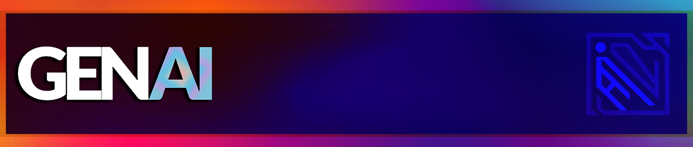
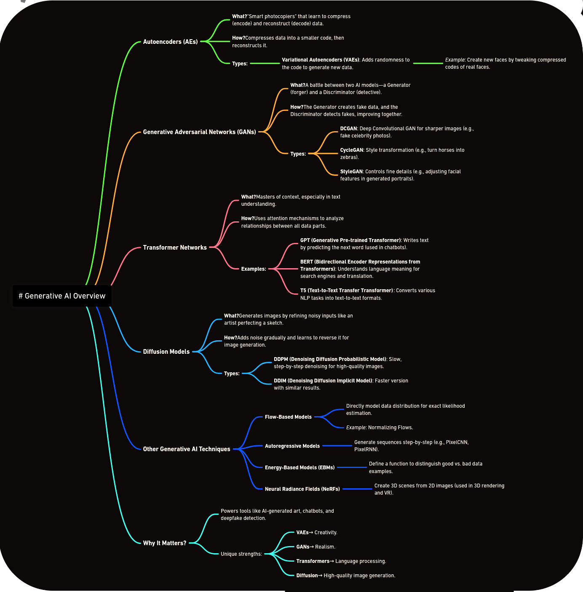
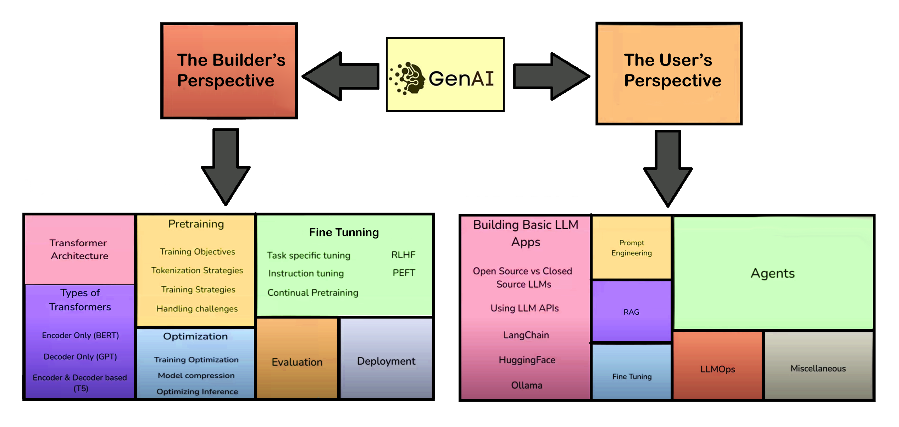

# 🤖 GenAI with Langchain and Huggingface

<div align="center">

[**🚀 Quick Start**](#-quick-start) |
[**🎯 What is GenAI?**](#-what-is-genai) |
[**🔧 Types of GenAI**](#-types-of-generative-ai) |
[**👨‍💻 Builder's Perspective**](#-builders-perspective) |
[**👤 User's Perspective**](#-users-perspective) |
[**📚 Projects**](#-projects) |
[**⚡ Installation**](#-installation)


</div>

<div align="center">
    
</div>

<div align="center">
    <h3>🌟 Build Production-Ready Generative AI Applications</h3>
</div>

This repository demonstrates the implementation of **Generative AI systems** using LangChain for workflow orchestration and HuggingFace for state-of-the-art models. Unlike traditional AI approaches, this framework enables **scalable**, **modular**, and **production-ready** AI applications capable of **complex text generation**, **multimodal processing**, and **seamless model integration**.

<div align="center">
    
    <p><em>🔄 Complete Generative AI Pipeline Architecture</em></p>
</div>

---

## 📋 Table of Contents

- [🤖 GenAI with Langchain and Huggingface](#-genai-with-langchain-and-huggingface)
  - [📋 Table of Contents](#-table-of-contents)
  - [🚀 Quick Start](#-quick-start)
  - [🎯 What is GenAI?](#-what-is-genai)
    - [🌟 Core Principles](#-core-principles)
  - [🔧 Types of Generative AI](#-types-of-generative-ai)
    - [🎨 Supported Model Types](#-supported-model-types)
  - [👨‍💻 Builder's Perspective](#-builders-perspective)
    - [1. 🏗️ Foundation Model Architecture](#1-️-foundation-model-architecture)
    - [2. 🔄 Model Training Pipeline](#2--model-training-pipeline)
    - [3. 📊 Data Processing](#3--data-processing)
    - [4. 🧠 Model Architecture](#4--model-architecture)
    - [5. 🖥️ Training Infrastructure](#5-️-training-infrastructure)
    - [6. 🚀 Deployment Strategy](#6--deployment-strategy)
  - [👤 User's Perspective](#-users-perspective)
    - [1. 🎨 Interface Design](#1--interface-design)
    - [2. 🤝 User Interaction](#2--user-interaction)
    - [3. ⚡ Response Generation](#3--response-generation)
    - [4. 🔗 System Integration](#4--system-integration)
    - [5. 📈 Performance Metrics](#5--performance-metrics)
  - [⚡ Installation](#-installation)
    - [🐍 Using UV (Recommended)](#-using-uv-recommended)
    - [🔧 Alternative Installation](#-alternative-installation)
  - [🛠️ Usage Examples](#️-usage-examples)
  - [🤝 Contributing](#-contributing)
    - [🚀 Quick Contribution Guide](#-quick-contribution-guide)
  - [📄 License](#-license)
  - [💖 Support](#-support)
  - [🪙Credits and Inspiration](#credits-and-inspiration)
  - [🔗Connect with me](#connect-with-me)

---

## 🚀 Quick Start

Get up and running in less than 5 minutes:

```bash
# 1. Clone the repository
git clone https://github.com/mohd-faizy/GenAI-with-Langchain-and-Huggingface.git
cd GenAI-with-Langchain-and-Huggingface

# 2. Set up environment
uv venv && source .venv/bin/activate  # Linux/Mac
# OR
uv venv && .venv\Scripts\activate     # Windows

# 3. Install dependencies
uv add -r requirements.txt

# 4. Run your first GenAI app
python examples/basic_text_generation.py
```

---

## 🎯 What is GenAI?


> **🧠 Generative AI** is a revolutionary branch of artificial intelligence that creates entirely new content — `text`, `images`, `audio`, `code`, and `video` — by learning intricate patterns and relationships from vast datasets. It doesn't just analyze; it **creates**, **innovates**, and **imagines**.

### 🌟 Core Principles

**Generative AI** learns the **distribution of data** to generate new, original samples that maintain the essence of the training data while being completely novel.

<div align="center">

| 🎨 **Domain** | 🔧 **Technology** | 🌟 **Examples** |
|:---:|:---:|:---:|
| **💬 Text** | Large Language Models | ChatGPT, Claude, Gemini |
| **🖼️ Images** | Diffusion Models | DALL-E, Midjourney, Stable Diffusion |
| **💻 Code** | Code Generation LLMs | GitHub Copilot, CodeLlama |
| **🎵 Audio** | Neural Audio Synthesis | ElevenLabs, Mubert |
| **🎬 Video** | Video Generation Models | Sora, RunwayML |

</div>

---

## 🔧 Types of Generative AI

<div align="center">
    
    <p><em>🎨 Comprehensive Overview of Generative AI Model Categories</em></p>
</div>

### 🎨 Supported Model Types

<details>
<summary><strong>📝 Text Generation Models</strong></summary>

- **🤖 GPT Family**: GPT-3.5, GPT-4, GPT-4 Turbo
- **🔄 T5 Variants**: T5-Small, T5-Base, T5-Large, Flan-T5
- **🧠 BERT Derivatives**: RoBERTa, DeBERTa, ALBERT
- **🦙 Open Source**: Llama 2, Mistral, Falcon

</details>

<details>
<summary><strong>🖼️ Image Generation</strong></summary>

- **🎨 Stable Diffusion**: SD 1.5, SD 2.1, SDXL
- **🎭 DALL-E Integration**: DALL-E 2, DALL-E 3
- **🖌️ Custom Models**: ControlNet, LoRA fine-tuning
- **⚡ Real-time Generation**: LCM, Turbo models

</details>

<details>
<summary><strong>🎵 Audio Processing</strong></summary>

- **🎤 Speech-to-Text**: Whisper, Wav2Vec2
- **🗣️ Text-to-Speech**: Bark, Tortoise TTS
- **🎼 Music Generation**: MusicLM, Jukebox
- **🔊 Audio Enhancement**: Real-ESRGAN Audio

</details>

---

## 👨‍💻 Builder's Perspective

<div align="center">
    <h3>🏗️ Deep Dive into GenAI Architecture</h3>
    <p><em>Understanding the technical foundations that power modern AI systems</em></p>
</div>

### 1. 🏗️ Foundation Model Architecture

<div align="center">
    
    <p><em>🧱 Core architectural components of foundation models</em></p>
</div>

**Key Components:**
- **🔤 Tokenization Layer**: Converting raw text to numerical representations
- **🧠 Transformer Blocks**: Self-attention mechanisms for context understanding
- **📊 Embedding Layers**: Dense vector representations of tokens
- **🎯 Output Heads**: Task-specific prediction layers

### 2. 🔄 Model Training Pipeline

<div align="center">
    
    <p><em>⚙️ End-to-end model training workflow</em></p>
</div>

**Training Stages:**
- **📚 Pre-training**: Learning from massive text corpora
- **🎯 Fine-tuning**: Task-specific adaptation
- **🔧 RLHF**: Reinforcement Learning from Human Feedback
- **✅ Evaluation**: Comprehensive model assessment

### 3. 📊 Data Processing

<div align="center">
    
    <p><em>🔄 Data preprocessing and augmentation pipeline</em></p>
</div>

**Processing Steps:**
- **🧹 Data Cleaning**: Removing noise and inconsistencies
- **🔀 Augmentation**: Expanding dataset diversity
- **⚖️ Balancing**: Ensuring representative samples
- **🔒 Privacy**: Implementing data protection measures

### 4. 🧠 Model Architecture

<div align="center">
    
    <p><em>🏛️ Detailed neural network architecture design</em></p>
</div>

**Architecture Elements:**
- **🔗 Layer Connections**: Skip connections and residual blocks
- **⚡ Activation Functions**: ReLU, GELU, Swish optimizations
- **📏 Normalization**: Layer norm and batch norm strategies
- **🎛️ Hyperparameters**: Learning rates, batch sizes, regularization

### 5. 🖥️ Training Infrastructure

<div align="center">
    
    <p><em>☁️ Scalable cloud infrastructure for model training</em></p>
</div>

**Infrastructure Components:**
- **💻 Compute Resources**: GPUs, TPUs, distributed training
- **💾 Storage Systems**: High-performance data storage
- **🌐 Networking**: High-bandwidth interconnects
- **📊 Monitoring**: Real-time training metrics

### 6. 🚀 Deployment Strategy

<div align="center">
    
    <p><em>🌍 Production deployment and scaling strategies</em></p>
</div>

**Deployment Options:**
- **☁️ Cloud Deployment**: AWS, GCP, Azure integration
- **🏠 On-Premise**: Local server deployment
- **📱 Edge Computing**: Mobile and IoT deployment
- **🔄 Auto-scaling**: Dynamic resource allocation

---

## 👤 User's Perspective

<div align="center">
    <h3>🎨 Crafting Exceptional User Experiences</h3>
    <p><em>Designing intuitive interfaces for complex AI systems</em></p>
</div>

### 1. 🎨 Interface Design

<div align="center">
    
    <p><em>🖼️ Modern, intuitive user interface design principles</em></p>
</div>

**Design Principles:**
- **🎯 User-Centric**: Intuitive navigation and clear workflows
- **📱 Responsive**: Works seamlessly across all devices
- **♿ Accessible**: WCAG compliant for all users
- **🎨 Beautiful**: Modern aesthetics with purposeful design

### 2. 🤝 User Interaction

<div align="center">
    
    <p><em>💬 Natural and engaging user interaction patterns</em></p>
</div>

**Interaction Features:**
- **💬 Chat Interface**: Natural language conversations
- **🎛️ Parameter Controls**: Fine-tune model behavior
- **📁 File Upload**: Multi-format document processing
- **🔄 Real-time Updates**: Live generation feedback

### 3. ⚡ Response Generation

<div align="center">
    
    <p><em>🚀 Lightning-fast response generation pipeline</em></p>
</div>

**Generation Process:**
- **⚡ Streaming**: Real-time token generation
- **🎯 Context Awareness**: Maintaining conversation history
- **🔧 Customization**: User-defined parameters
- **✅ Quality Control**: Output validation and filtering

### 4. 🔗 System Integration

<div align="center">
    
    <p><em>🌐 Seamless integration with existing systems</em></p>
</div>

**Integration Capabilities:**
- **🔌 API Endpoints**: RESTful and GraphQL APIs
- **🔗 Webhooks**: Event-driven integrations
- **📊 Database**: Persistent data storage
- **🔐 Authentication**: Secure user management

### 5. 📈 Performance Metrics

<div align="center">
    
    <p><em>📊 Comprehensive performance monitoring and analytics</em></p>
</div>

**Key Metrics:**
- **⚡ Response Time**: Sub-second generation speeds
- **🎯 Accuracy**: High-quality output consistency
- **👥 User Satisfaction**: Feedback and rating systems
- **📈 Usage Analytics**: Detailed usage insights

---

## ⚡ Installation

### 🐍 Using UV (Recommended)

```bash
# 📥 Clone the repository
git clone https://github.com/mohd-faizy/GenAI-with-Langchain-and-Huggingface.git
cd GenAI-with-Langchain-and-Huggingface

# 🏗️ Initialize UV project
uv init

# 🌐 Create virtual environment
uv venv

# 🔌 Activate environment
# Linux/Mac:
source .venv/bin/activate
# Windows:
.venv\Scripts\activate

# 📦 Install dependencies
uv add -r requirements.txt
```

### 🔧 Alternative Installation

<details>
<summary><strong>🐍 Using pip</strong></summary>

```bash
# 📥 Clone repository
git clone https://github.com/mohd-faizy/GenAI-with-Langchain-and-Huggingface.git
cd GenAI-with-Langchain-and-Huggingface

# 🌐 Create virtual environment
python -m venv genai_env

# 🔌 Activate environment
# Linux/Mac:
source genai_env/bin/activate
# Windows:
genai_env\Scripts\activate

# 📦 Install dependencies
pip install -r requirements.txt
```

</details>

<details>
<summary><strong>🐍 Using conda</strong></summary>

```bash
# 📥 Clone repository
git clone https://github.com/mohd-faizy/GenAI-with-Langchain-and-Huggingface.git
cd GenAI-with-Langchain-and-Huggingface

# 🌐 Create conda environment
conda create -n genai_env python=3.9
conda activate genai_env

# 📦 Install dependencies
pip install -r requirements.txt
```

</details>

---

## 🛠️ Usage Examples

<details>
<summary><strong>💬 Basic Text Generation</strong></summary>

```python
from langchain.llms import HuggingFacePipeline
from transformers import pipeline

# 🤖 Initialize model
generator = pipeline("text-generation", 
                    model="microsoft/DialoGPT-medium")
llm = HuggingFacePipeline(pipeline=generator)

# 💬 Generate response
response = llm("Hello, how are you?")
print(response)
```

</details>

<details>
<summary><strong>📄 Document Q&A</strong></summary>

```python
from langchain.document_loaders import PyPDFLoader
from langchain.vectorstores import FAISS
from langchain.chains import RetrievalQA

# 📄 Load document
loader = PyPDFLoader("document.pdf")
documents = loader.load()

# 🔍 Create vector store
vectorstore = FAISS.from_documents(documents, embeddings)

# ❓ Setup Q&A chain
qa_chain = RetrievalQA.from_chain_type(
    llm=llm,
    retriever=vectorstore.as_retriever()
)

# 💬 Ask question
answer = qa_chain.run("What is the main topic?")
```

</details>


---

## 🤝 Contributing

### 🚀 Quick Contribution Guide

1. **🍴 Fork** the repository
2. **🌿 Create** your feature branch (`git checkout -b feature/AmazingFeature`)
3. **💾 Commit** your changes (`git commit -m 'Add some AmazingFeature'`)
4. **📤 Push** to the branch (`git push origin feature/AmazingFeature`)
5. **🔄 Open** a Pull Request
   
<div align="center">

| 🎯 **Type** | 📝 **Description** | 🔗 **How to Help** |
|:---:|:---:|:---:|
| **🐛 Bug Reports** | Found an issue? | [Open an Issue](https://github.com/mohd-faizy/GenAI-with-Langchain-and-Huggingface/issues) |
| **📝 Documentation** | Improve docs | [Edit Documentation](https://github.com/mohd-faizy/GenAI-with-Langchain-and-Huggingface/tree/main/docs) |
| **💻 Code** | Add features | [Submit Pull Request](https://github.com/mohd-faizy/GenAI-with-Langchain-and-Huggingface/pulls) |

</div>


---

## 📄 License

This project is licensed under the **MIT License** - see the [LICENSE](LICENSE) file for details.

---

## 💖 Support

<div align="center">
    <h3>🌟 Show Your Support</h3>
    <p>If this repo helped you, please consider:</p>

| 🎯 **Action** | 📝 **Description** |
|:---:|:---:|
| ⭐ **Star this repo** | Show appreciation |
| 🤝 **Contribute** | Make it better |

</div>

<div align="center">
    <a href="https://github.com/mohd-faizy/GenAI-with-Langchain-and-Huggingface/stargazers">
        
    </a>
    <a href="https://twitter.com/F4izy">
        
    </a>
</div>


---

## 🪙Credits and Inspiration

This repository draws inspiration from the exceptional educational content developed by Nitish, Krish Naik, and the DataCamp course `Developing LLMs with LangChain`. The implementations and examples provided here are grounded in their comprehensive tutorials on Generative AI, with a particular focus on LangChain and Hugging Face.

## 🔗Connect with me

➤ If you have questions or feedback, feel free to reach out!!!

[][twitter]
[][linkedin]
[][Portfolio]

[twitter]: https://twitter.com/F4izy
[linkedin]: https://www.linkedin.com/in/mohd-faizy/
[Portfolio]: https://ai.stackexchange.com/users/36737/faizy?tab=profile


