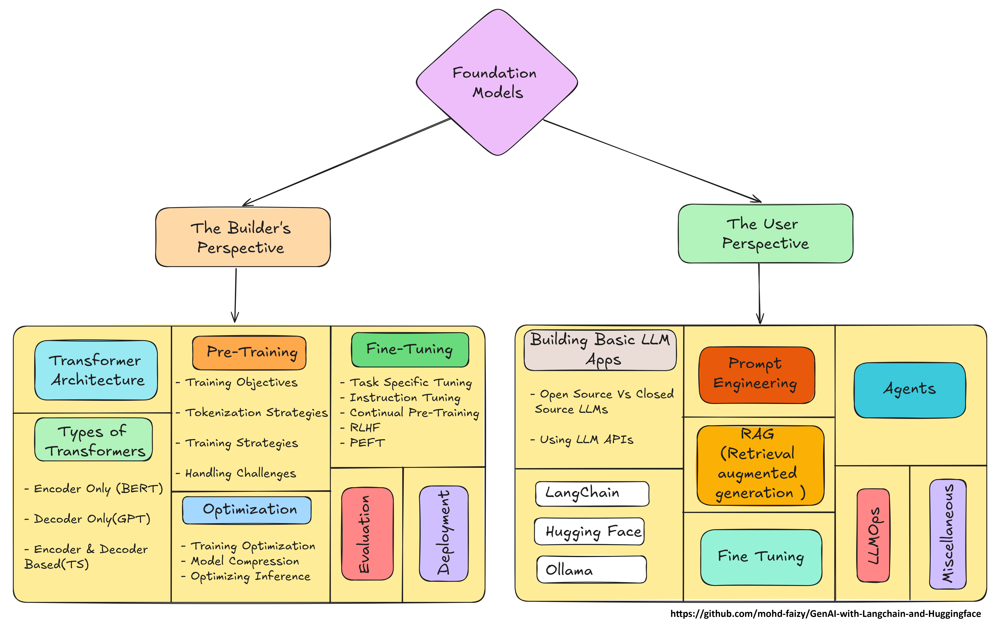

# GenAI with Langchain and Huggingface 🤗

> This repository serves as a comprehensive guide for integrating Langchain with Huggingface models, enabling you to build, deploy, and optimize cutting-edge AI applications through hands-on projects and real-world examples.

<div align="center">
    
    <p><em>Overview of Generative AI Pipeline</em></p>
</div>


[](https://opensource.org/licenses/MIT)

## Table of Contents
- [GenAI with Langchain and Huggingface 🤗](#genai-with-langchain-and-huggingface-)
  - [Table of Contents](#table-of-contents)
  - [Overview](#overview)
  - [Key Features](#key-features)
  - [Types of Generative AI](#types-of-generative-ai)
    - [Supported Model Types](#supported-model-types)
- [⭐Builder's Perspective](#builders-perspective)
    - [1. Foundation Model Architecture](#1-foundation-model-architecture)
    - [2. Model Training Pipeline](#2-model-training-pipeline)
    - [3. Data Processing](#3-data-processing)
    - [4. Model Architecture](#4-model-architecture)
    - [5. Training Infrastructure](#5-training-infrastructure)
    - [6. Deployment Strategy](#6-deployment-strategy)
- [⭐User's Perspective](#users-perspective)
    - [1. Interface Design](#1-interface-design)
    - [2. User Interaction](#2-user-interaction)
    - [3. Response Generation](#3-response-generation)
    - [4. System Integration](#4-system-integration)
    - [5. Performance Metrics](#5-performance-metrics)
  - [Project Structure](#project-structure)
  - [Installation](#installation)
  - [Getting Started](#getting-started)
  - [Examples](#examples)
  - [Contributing](#contributing)
  - [⚖ ➤ License](#--license)
  - [❤️ Support](#️-support)
  - [🪙Credits and Inspiration](#credits-and-inspiration)
  - [🔗Connect with me](#connect-with-me)

## Overview
This repository demonstrates the power of combining Langchain's composability with Huggingface's state-of-the-art models. We provide comprehensive examples and implementations for various Generative AI applications, from text generation to multimodal systems.

## Key Features
- 🔗 **Langchain Integration**: Seamless integration with Langchain's powerful components
- 🤗 **Huggingface Models**: Access to cutting-edge pre-trained models
- 📚 **Comprehensive Examples**: Detailed notebooks and use cases
- 🛠️ **Production-Ready Code**: Optimized implementations for real-world applications
- 📈 **Performance Metrics**: Detailed analysis and benchmarking tools

## Types of Generative AI

<div align="center">
    
    <p><em>Different Types of Generative AI Models and Their Applications</em></p>
</div>

### Supported Model Types
1. **Text Generation Models**
   - GPT-based models
   - T5 variants
   - BERT derivatives

2. **Image Generation**
   - Stable Diffusion
   - DALL-E integration
   - Midjourney-like implementations

3. **Audio Processing**
   - Speech-to-Text
   - Text-to-Speech
   - Audio Generation

---

# ⭐Builder's Perspective

### 1. Foundation Model Architecture
<div align="center">
    
</div>


### 2. Model Training Pipeline
<div align="center">
    
</div>


### 3. Data Processing
<div align="center">
    
</div>

### 4. Model Architecture
<div align="center">
    
</div>

### 5. Training Infrastructure
<div align="center">
    
</div>

### 6. Deployment Strategy
<div align="center">
    
</div>

---

# ⭐User's Perspective

### 1. Interface Design
<div align="center">
    
</div>

### 2. User Interaction
<div align="center">
    
</div>

### 3. Response Generation
<div align="center">
    
</div>

### 4. System Integration
<div align="center">
    
</div>

### 5. Performance Metrics
<div align="center">
    
</div>

## Project Structure
```
GenAI-with-Langchain-and-Huggingface/
├── examples/
│   ├── text_generation/
│   ├── image_generation/
│   └── audio_processing/
├── notebooks/
│   ├── 01_
│   ├── 02_
│   └── 03_
├── src/
│   ├── models/
│   ├── utils/
│   └── config/
├── tests/
└── docs/
```

## Installation

```bash
# Clone the repository
git clone https://github.com/mohd-faizy/GenAI-with-Langchain-and-Huggingface.git

# Navigate to the project directory
cd GenAI-with-Langchain-and-Huggingface

# Create and activate virtual environment
python -m venv venv
source venv/bin/activate  # On Windows: venv\Scripts\activate

# Install required packages
pip install -r requirements.txt

```

## Getting Started

```python
from langchain import LLMChain
from transformers import AutoModelForCausalLM, AutoTokenizer

# Initialize model and tokenizer
model_name = "gpt2"
tokenizer = AutoTokenizer.from_pretrained(model_name)
model = AutoModelForCausalLM.from_pretrained(model_name)

# Create a simple chain
chain = LLMChain(
    llm=model,
    prompt_template="Write a story about {topic}"
)

# Run the chain
result = chain.run(topic="space exploration")
print(result)
```

## Examples
Check our [examples directory](./examples) for complete implementations:
- Text Generation Pipeline
- Image Generation with Stable Diffusion
- Question Answering Systems
- Document Analysis
- Chatbot Implementation

## Contributing

1. Fork the repository
2. Create your feature branch (`git checkout -b feature/AmazingFeature`)
3. Commit your changes (`git commit -m 'Add some AmazingFeature'`)
4. Push to the branch (`git push origin feature/AmazingFeature`)
5. Open a Pull Request

## ⚖ ➤ License

This project is licensed under the **MIT License**. See the [LICENSE](LICENSE) file for details.  

## ❤️ Support

If you find this repository helpful, show your support by starring it! For questions or feedback, reach out on [Twitter(`X`)](https://twitter.com/F4izy).

## 🪙Credits and Inspiration

This repository is inspired by the excellent course content created by [Nitish Rajput](https://www.youtube.com/@campusx-official) on the CampusX YouTube channel. The implementation and examples in this repository are based on his comprehensive tutorials on Generative AI with Langchain and Huggingface.

📺 **Original Course:**

- **Channel**: [CampusX](https://www.youtube.com/@campusx-official)
- **Instructor**: *Nitish Rajput*
- **Course Link**: [Generative AI Course](https://www.youtube.com/watch?v=pSVk-5WemQ0&list=PLKnIA16_RmvaTbihpo4MtzVm4XOQa0ER0)

## 🔗Connect with me

➤ If you have questions or feedback, feel free to reach out!!!

[][twitter]
[][linkedin]
[][Portfolio]

[twitter]: https://twitter.com/F4izy
[linkedin]: https://www.linkedin.com/in/mohd-faizy/
[Portfolio]: https://ai.stackexchange.com/users/36737/faizy?tab=profile

---


