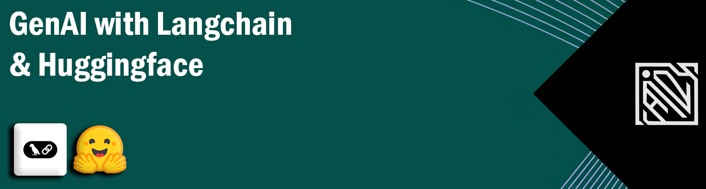
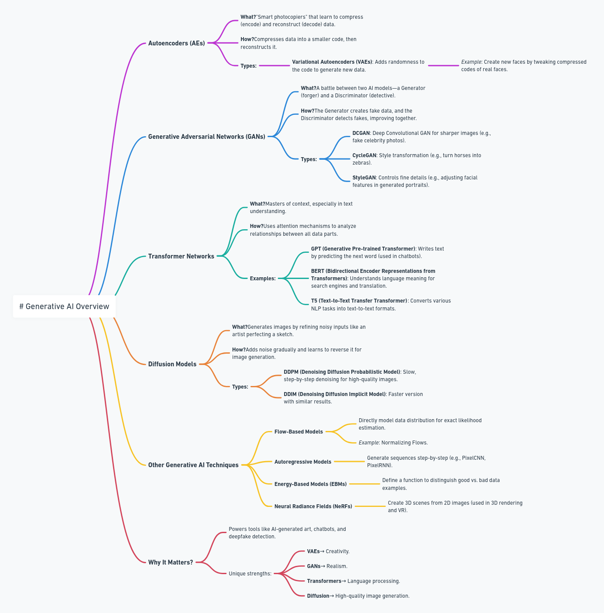

# GenAI with Langchain and Huggingface 🤗

<div align="center">
    
</div>


[](https://opensource.org/licenses/MIT)

> This repository serves as a comprehensive guide for integrating Langchain with Huggingface models, enabling you to build, deploy, and optimize cutting-edge AI applications through hands-on projects and real-world examples.

<div align="center">
    
    <p><em>Overview of Generative AI Pipeline</em></p>
</div>


## Table of Contents
- [GenAI with Langchain and Huggingface 🤗](#genai-with-langchain-and-huggingface-)
  - [Table of Contents](#table-of-contents)
  - [Overview](#overview)
  - [What is GenAI?](#what-is-genai)
  - [Types of Generative AI](#types-of-generative-ai)
    - [Supported Model Types](#supported-model-types)
- [⭐Builder's Perspective](#builders-perspective)
    - [1. Foundation Model Architecture](#1-foundation-model-architecture)
    - [2. Model Training Pipeline](#2-model-training-pipeline)
    - [3. Data Processing](#3-data-processing)
    - [4. Model Architecture](#4-model-architecture)
    - [5. Training Infrastructure](#5-training-infrastructure)
    - [6. Deployment Strategy](#6-deployment-strategy)
- [⭐User's Perspective](#users-perspective)
    - [1. Interface Design](#1-interface-design)
    - [2. User Interaction](#2-user-interaction)
    - [3. Response Generation](#3-response-generation)
    - [4. System Integration](#4-system-integration)
    - [5. Performance Metrics](#5-performance-metrics)
  - [Installation](#installation)
  - [Getting Started](#getting-started)
  - [Examples](#examples)
  - [Contributing](#contributing)
  - [⚖ ➤ License](#--license)
  - [❤️ Support](#️-support)
  - [🪙Credits and Inspiration](#credits-and-inspiration)
  - [🔗Connect with me](#connect-with-me)

## Overview
This repository demonstrates the power of combining Langchain's composability with Huggingface's state-of-the-art models. We provide comprehensive examples and implementations for various Generative AI applications, from text generation to multimodal systems.

## What is GenAI?
> **Generative AI** is a branch of artificial intelligence that focuses on creating entirely new content — such as `text`, `images`, `audio`, `code`, or video—by learning patterns, structures, and relationships from existing data. It mimics human creativity to generate outputs that are not only original but also remarkably similar to content produced by people, blurring the line between human-made and machine-generated work.

> **Generative AI** is about learning the distribution of data so that it can generate a new sample from it. 

- LLMs based apps like `ChatGPT`
- `Diffusion` models for image
- Code generating LLMs like `CodeLLama`
- TTS models like `ElevenLabs`
- Video gen model like `Sora` 


<div align="center">
    
</div>

## Types of Generative AI

<div align="center">
    
    <p><em>Different Types of Generative AI Models and Their Applications</em></p>
</div>

### Supported Model Types
1. **Text Generation Models**
   - GPT-based models
   - T5 variants
   - BERT derivatives

2. **Image Generation**
   - Stable Diffusion
   - DALL-E integration
   - Midjourney-like implementations

3. **Audio Processing**
   - Speech-to-Text
   - Text-to-Speech
   - Audio Generation

---

# ⭐Builder's Perspective

### 1. Foundation Model Architecture
<div align="center">
    
</div>


### 2. Model Training Pipeline
<div align="center">
    
</div>


### 3. Data Processing
<div align="center">
    
</div>

### 4. Model Architecture
<div align="center">
    
</div>

### 5. Training Infrastructure
<div align="center">
    
</div>

### 6. Deployment Strategy
<div align="center">
    
</div>

---

# ⭐User's Perspective

### 1. Interface Design
<div align="center">
    
</div>

### 2. User Interaction
<div align="center">
    
</div>

### 3. Response Generation
<div align="center">
    
</div>

### 4. System Integration
<div align="center">
    
</div>

### 5. Performance Metrics
<div align="center">
    
</div>

<!-- ## Project Structure
```
GenAI-with-Langchain-and-Huggingface/
├── 
│   ├── 
│   ├── 
│   └── 
├── 
│   ├── 01_
│   ├── 02_
│   └── 03_
├── src/
│   ├── models/
│   ├── utils/
│   └── config/
├── tests/
└── docs/
``` -->

## Installation

```bash
# Clone the repository from GitHub
git clone https://github.com/mohd-faizy/GenAI-with-Langchain-and-Huggingface.git

# Navigate into the cloned project directory
cd GenAI-with-Langchain-and-Huggingface

# Initialize a new uv project (creates pyproject.toml and sets up uv)
uv init

# Create a virtual environment using uv (similar to python -m venv .venv)
uv venv

# Activate the virtual environment
# For macOS/Linux:
.venv/bin/activate  
# For Windows (use this instead):
# venv\Scripts\activate

# Install all required packages listed in requirements.txt
uv add -r requirements.txt

```

## Getting Started

```python
from langchain import LLMChain
from transformers import AutoModelForCausalLM, AutoTokenizer

# Initialize model and tokenizer
model_name = "gpt2"
tokenizer = AutoTokenizer.from_pretrained(model_name)
model = AutoModelForCausalLM.from_pretrained(model_name)

# Create a simple chain
chain = LLMChain(
    llm=model,
    prompt_template="Write a story about {topic}"
)

# Run the chain
result = chain.run(topic="space exploration")
print(result)
```

## Examples
Check our [examples directory](./examples) for complete implementations:
- Text Generation Pipeline
- Image Generation with Stable Diffusion
- Question Answering Systems
- Document Analysis
- Chatbot Implementation

## Contributing

1. Fork the repository
2. Create your feature branch (`git checkout -b feature/AmazingFeature`)
3. Commit your changes (`git commit -m 'Add some AmazingFeature'`)
4. Push to the branch (`git push origin feature/AmazingFeature`)
5. Open a Pull Request

## ⚖ ➤ License

This project is licensed under the **MIT License**. See the [LICENSE](LICENSE) file for details.  

## ❤️ Support

If you find this repository helpful, show your support by starring it! For questions or feedback, reach out on [Twitter(`X`)](https://twitter.com/F4izy).

## 🪙Credits and Inspiration

This repository is inspired by the excellent course content created by [Nitish](https://www.youtube.com/@campusx-official) on the CampusX YouTube channel & DataCamps Course Developing LLMs with LangChain. The implementation and examples in this repository are based on his comprehensive tutorials on Generative AI with Langchain and Huggingface.

## 🔗Connect with me

➤ If you have questions or feedback, feel free to reach out!!!

[][twitter]
[][linkedin]
[][Portfolio]

[twitter]: https://twitter.com/F4izy
[linkedin]: https://www.linkedin.com/in/mohd-faizy/
[Portfolio]: https://ai.stackexchange.com/users/36737/faizy?tab=profile

---


